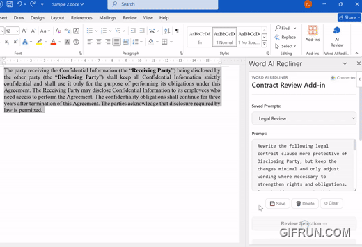

# Word AI Redliner

AI-powered Microsoft Word add-in that applies word-level tracked changes using
a structure-aware diff strategy.

<p align="center">
  <a href="https://www.youtube.com/watch?v=0Oa05jk3wrU">
    
  </a>
</p>

**Project history**: This library was extracted from a private codebase and open-sourced as a standalone project in Jan 2026.

## Features

- Word-level diffs with tracked changes
- Token map strategy with sentence fallback
- Prompt management for custom review templates

## Setup

There are **two ways** to run this add-in:

| Method | Best for | Requirements |
|--------|----------|--------------|
| **Docker** | Quick setup, no Node.js needed | Docker, Docker Compose |
| **npm** | Development, customization | Node.js 18+ |

Both methods require HTTPS certificates trusted by the machine running Word.

---

## Option A: Docker (Recommended for Quick Setup)

### Prerequisites

- Docker and Docker Compose
- HTTPS certificate files (see [Create HTTPS Certificates](#create-https-certificates))

### Step-by-Step

1. **Clone the repository**

```bash
git clone https://github.com/yuch85/word-ai-redliner.git
cd word-ai-redliner
```

2. **Create HTTPS certificates** (see [Create HTTPS Certificates](#create-https-certificates))

   Place `server.pem` and `server-key.pem` in the project root.

3. **Configure environment variables**

   Copy the Docker example and edit it:

```bash
cp .env.docker.example .env
```

   On Windows PowerShell:

```powershell
Copy-Item .env.docker.example .env
```

   **Important:** Edit `.env` and set `HOST` to the hostname or IP address that
   the Word client can reach. If Word runs on a different machine, do **not**
   use `localhost`.

4. **Start the container**

```bash
docker compose up -d
```

   The container automatically generates `manifest.xml` on first startup using
   your `.env` values. The manifest is written to the project root.

5. **Trust the certificate on Windows** (see [Trust the Certificate on Windows](#trust-the-certificate-on-windows))

6. **Sideload the add-in** (see [Sideload the Add-in](#sideload-the-add-in))

   Use the `manifest.xml` file in the project root.

---

## Option B: npm (For Development)

### Prerequisites

- Node.js 18+
- HTTPS certificate files (see [Create HTTPS Certificates](#create-https-certificates))

### Step-by-Step

1. **Clone the repository**

```bash
git clone https://github.com/yuch85/word-ai-redliner.git
cd word-ai-redliner
```

2. **Install dependencies**

```bash
npm install
```

3. **Create HTTPS certificates** (see [Create HTTPS Certificates](#create-https-certificates))

   Place `server.pem` and `server-key.pem` in the project root.

4. **Configure environment variables**

   Copy the example and edit it:

```bash
cp .env.example .env
```

   On Windows PowerShell:

```powershell
Copy-Item .env.example .env
```

   **Important:** Edit `.env` and set `HOST` to the hostname or IP address that
   the Word client can reach. If Word runs on a different machine, do **not**
   use `localhost`.

5. **Start the dev server**

```bash
npm start
```

   This generates `manifest.xml` from your `.env` values and starts the webpack
   dev server with hot reload.

6. **Trust the certificate on Windows** (see [Trust the Certificate on Windows](#trust-the-certificate-on-windows))

7. **Sideload the add-in** (see [Sideload the Add-in](#sideload-the-add-in))

   Use the `manifest.xml` file in the project root.

---

## Create HTTPS Certificates

The add-in must be served over HTTPS. Word will block untrusted certificates.

Place your cert files in the project root:

- `server.pem` (certificate)
- `server-key.pem` (private key)

### Option 1: mkcert (Recommended)

1. Install [mkcert](https://github.com/FiloSottile/mkcert).
2. Create a local CA and generate a cert:

```bash
mkcert -install

# For localhost (same machine):
mkcert localhost

# For a remote server (use your actual IP or hostname):
mkcert <your-server-ip-or-hostname>
```

3. Rename the output files:

```bash
cp localhost.pem server.pem
cp localhost-key.pem server-key.pem
```

   On Windows PowerShell:

```powershell
Copy-Item localhost.pem server.pem
Copy-Item localhost-key.pem server-key.pem
```

### Option 2: OpenSSL (Manual)

```bash
# Replace <YOUR_HOST> with localhost or your server IP/hostname
openssl req -x509 -nodes -days 365 \
  -newkey rsa:2048 \
  -keyout server-key.pem \
  -out server.pem \
  -subj "/CN=<YOUR_HOST>"
```

---

## Trust the Certificate on Windows

On the Windows PC running Word:

1. Copy the `.pem` cert file to the Windows PC.
2. Convert PEM to CRT (if needed):

```powershell
openssl x509 -in server.pem -out server.crt
```

3. Open **certmgr.msc** (run as Administrator).
4. Navigate to **Trusted Root Certification Authorities** → **Certificates**.
5. Right-click → **All Tasks** → **Import...**
6. Select the `.crt` file and finish the wizard.

**If you used mkcert**, you can install the mkcert root CA on Windows instead:

- Copy the root CA from the server machine (find it via `mkcert -CAROOT`)
- Import it into **Trusted Root Certification Authorities**

---

## Sideload the Add-in

### Word on Windows

**Method 1: Add from file**

1. Open Word → **Insert** → **Get Add-ins** → **My Add-ins**.
2. Click **Add a custom add-in** → **Add from file...**.
3. Select `manifest.xml` and confirm.

**Method 2: Network shared folder (Windows only)**

1. Create a shared folder and note the network path.
2. In Word: **File** → **Options** → **Trust Center** → **Trust Center Settings** →
   **Trusted Add-in Catalogs** → **Add catalog** (check **Show in Menu**).
3. Copy `manifest.xml` into the shared folder.
4. In Word: **Home** → **Add-ins** → **Advanced** → **Shared Folder** → select the add-in → **Add**.

For full details, see the [Microsoft sideloading guide](https://learn.microsoft.com/en-us/office/dev/add-ins/testing/create-a-network-shared-folder-catalog-for-task-pane-and-content-add-ins).

### Word on Mac

1. Start the server (`docker compose up -d` or `npm start`).
2. Open Word → **Insert** → **Add-ins** → **My Add-ins**.
3. Click **Add a custom add-in** → **Add from file...** → select `manifest.xml`.
4. Trust the certificate in Keychain if prompted.

---

## Troubleshooting

| Problem | Solution |
|---------|----------|
| Word shows "blocked because it isn't signed" | Trust the HTTPS certificate on the Windows client |
| Word cannot load the add-in | Verify `HOST` in `.env` is reachable from Word |
| Manifest not generated | Ensure `.env` exists before running `npm start` or `docker compose up` |
| Firewall issues | Allow inbound TCP 3000 on the server |

---

## Environment Variables

| Variable | Default | Description |
|----------|---------|-------------|
| `HOST` | `localhost` | Hostname for manifest URLs (must be reachable from Word) |
| `PORT` | `3000` | Port for manifest URLs |
| `PROTOCOL` | `https` | Protocol for manifest URLs |
| `DEV_SERVER_HOST` | `0.0.0.0` | Host to bind webpack dev server |
| `DEV_SERVER_PORT` | `3000` | Port for webpack dev server |
| `SSL_CERT_FILE` | `server.pem` | Path to SSL certificate |
| `SSL_KEY_FILE` | `server-key.pem` | Path to SSL private key |
| `OLLAMA_PROXY_PATH` | `/ollama` | Local proxy path for LLM requests |
| `OLLAMA_PROXY_TARGET` | `http://localhost:11434` | Upstream Ollama server URL |
| `DEFAULT_OLLAMA_URL` | `/ollama` | Default Ollama URL shown in UI |
| `DEFAULT_MODEL` | `gpt-oss:20b` | Default model shown in UI |

Users can override `DEFAULT_OLLAMA_URL` and `DEFAULT_MODEL` via the add-in
settings UI; those overrides persist in localStorage.

---

## Docker Image

Pre-built images are available on GitHub Container Registry:

```bash
docker pull ghcr.io/yuch85/word-ai-redliner:0.1.0
docker pull ghcr.io/yuch85/word-ai-redliner:latest
```

---

## Project Structure

See `ARCHITECTURE.md` for details.

## Licensing

This project is dual-licensed:

- **MIT License** applies to the Word add-in codebase.
- **Apache 2.0 License** applies to the `office-word-diff` library (used as a dependency).

See `LICENSE` and `LICENSE-APACHE` for details.

## Testing

The previous test suite referenced modules that are not present in the current
minimal codebase. The test directory is left empty and ready for new tests once
refactoring is complete.
