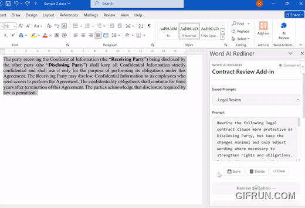

# Word AI Redliner

AI-powered Microsoft Word add-in that applies word-level tracked changes using
a structure-aware diff strategy — plus document summarization with comment
extraction and tracked changes analysis.

<p align="center">
  <a href="https://www.youtube.com/watch?v=0Oa05jk3wrU">
    
  </a>
</p>

**Project history**: This library was extracted from a private codebase and open-sourced as a standalone project in Jan 2026.

## Features

### Core: AI Redlining (v0.1.0)
- Word-level diffs with tracked changes via [office-word-diff](https://github.com/niclasgrunworked/office-word-diff)
- Token map strategy with sentence fallback, block replace as last resort
- Configurable LLM backends: Ollama and vLLM (OpenAI-compatible)

### v0.2.0: Prompt System + Document Summary

**Three-Category Prompt System**
- Context, Amendment, and Comment prompt categories with dedicated tabs
- Full CRUD: create, save, update, delete prompts per category
- Per-category activation with `{selection}` placeholder replacement
- Prompts persist in localStorage across sessions

**Document Comment Summary**
- 4th "Summary" tab — extract all document comments, send to LLM, generate a formatted Word document
- `{comments}` placeholder inserts structured comment data (author, annotated text, comment text)
- `{whole document}` placeholder extracts full document text with configurable richness:
  - **Plain** — raw paragraph text
  - **Headings** — markdown-style heading markers (`## Section Title`)
  - **Structured** — headings + list item numbering and indentation
- `{tracked changes}` placeholder extracts revision marks via OOXML parsing (w:ins, w:del, w:moveFrom, w:moveTo)
- Generated summary document includes annex with numbered source comments
- LLM markdown output auto-converted to HTML via [marked](https://github.com/markedjs/marked)
- Tables in generated documents render with visible borders

**Tracked Changes Extraction (OOXML)**
- Parses `body.getOoxml()` with browser DOMParser — no external dependencies
- Handles `pkg:package` wrapper, `w:proofErr` normalization
- Pairs adjacent `w:del` + `w:ins` from same author as replacements
- Detects move operations (`w:moveFrom` / `w:moveTo`)
- Skips table row revision markers (`w:ins`/`w:del` inside `w:trPr`)
- Namespace-aware querying with prefix fallback for cross-browser compatibility
- Author identity prominently included in LLM-formatted output

**Async Comment Queue**
- Bookmark-based range persistence for async comment insertion
- Comment status bar with pending count and retry-on-error
- WordApi 1.4 detection with graceful degradation

**Settings & UX**
- Settings auto-save on every change (no Save button)
- Live token estimation with real document metrics (async Word API read, cached, debounced)
- Document extraction richness dropdown (Summary mode only)
- Tracked changes extraction toggle (Summary mode only)
- Mode switching: Amendment/Comment tabs disabled when Summary is active
- Review button relabels to "Generate Summary" in Summary mode

**Backend Selector**
- Ollama and vLLM backends with unified OpenAI-compatible API
- Model dropdown auto-populated from backend `/v1/models` endpoint
- Configurable endpoint URL and optional API key
- Track Changes and Line Diff toggles

### v0.3.0: Whole-Document Processing

**Parallel LLM Orchestration**
- Full-document amendment and commenting: parse, chunk, dispatch to LLM in parallel, reassemble
- Worker-pool concurrency with configurable limits (auto-tuned: 4 workers for large chunks, 6 for smaller)
- AbortController-based cancellation stops pending chunks immediately
- Progress tracking with per-chunk ETA estimation
- Retry failed chunks without re-processing successful ones

**Document Parsing & Chunking**
- Paragraph-level document parsing with style and heading detection
- Token-aware chunking with configurable max size (default 6K tokens)
- Heading-based chunk boundaries (H1/H2 trigger splits; H3+ stay coherent)
- Overlap paragraphs provide preceding context to each chunk
- Tiny trailing chunks merged into previous chunk to prevent orphans

**Context Extraction**
- Automatic definition extraction via regex (means/shall-mean/is-defined-as, the-X, hereinafter-X patterns)
- Abbreviation expansion via word-initial matching heuristic
- Document outline generation from heading hierarchy
- Context prefix formatted and injected into each chunk's LLM system message

**Formatting-Preserving Reassembly**
- Paragraph-level amendment strategy: aligns LLM output paragraphs to original document paragraphs using LCS + word-level similarity matching
- Within-paragraph word-level diff via token map strategy preserves run-level formatting (bold, italic, font, color)
- Paragraph properties (styles, numbering, indentation) preserved through paragraph-scoped operations
- Graceful degradation chain: paragraph-level -> word-level diff -> sentence diff -> block replace
- Line ending normalization (`\r` <-> `\n`) throughout the pipeline
- Content validation rejects severely truncated LLM output before applying
- Amendments applied in reverse document order to prevent range invalidation
- Bookmarks persist chunk ranges across LLM processing time

**Merged Amendment + Comment Mode**
- Comment instructions persisted with prompt data (save/restore across sessions)
- When comment instructions are provided in amendment mode, LLM produces delimited `===AMENDMENT===` / `===COMMENT===` output
- Response parser extracts both sections; comments inserted on bookmarked ranges after all amendments
- Fallback: undelimited responses treated as amendment-only

**LLM Output Quality**
- Critical output rules appended to amendment prompts: no commentary, no markdown, preserve structure
- `stripMarkdown()` post-processor as safety net for amendment responses
- `stripThinkTags()` removes `<think>` reasoning blocks from LLM output

**Testing**
- 388 unit tests across 13 test suites (Jest)
- TDD workflow: failing tests written before implementation
- Covers: prompt state/persistence/composition, comment extraction, document generation, tracked changes OOXML parsing, orchestrator dispatch/concurrency, reassembler paragraph alignment, document chunking, context extraction

## Setup

There are **two ways** to run this add-in:

| Method | Best for | Requirements |
|--------|----------|--------------|
| **Docker** | Quick setup, no Node.js needed | Docker, Docker Compose |
| **npm** | Development, customization | Node.js 18+ |

Both methods require HTTPS certificates trusted by the machine running Word.

---

## Option A: Docker (Recommended for Quick Setup)

### Prerequisites

- Docker and Docker Compose
- HTTPS certificate files (see [Create HTTPS Certificates](#create-https-certificates))

### Step-by-Step

1. **Clone the repository**

```bash
git clone https://github.com/yuch85/word-ai-redliner.git
cd word-ai-redliner
```

2. **Create HTTPS certificates** (see [Create HTTPS Certificates](#create-https-certificates))

   Place `server.pem` and `server-key.pem` in the project root.

3. **Configure environment variables**

   Copy the Docker example and edit it:

```bash
cp .env.docker.example .env
```

   On Windows PowerShell:

```powershell
Copy-Item .env.docker.example .env
```

   **Important:** Edit `.env` and set `HOST` to the hostname or IP address that
   the Word client can reach. If Word runs on a different machine, do **not**
   use `localhost`.

4. **Start the container**

```bash
docker compose up -d
```

   The container automatically generates `manifest.xml` on first startup using
   your `.env` values. The manifest is written to the project root.

5. **Trust the certificate on Windows** (see [Trust the Certificate on Windows](#trust-the-certificate-on-windows))

6. **Sideload the add-in** (see [Sideload the Add-in](#sideload-the-add-in))

   Use the `manifest.xml` file in the project root.

---

## Option B: npm (For Development)

### Prerequisites

- Node.js 18+
- HTTPS certificate files (see [Create HTTPS Certificates](#create-https-certificates))

### Step-by-Step

1. **Clone the repository**

```bash
git clone https://github.com/yuch85/word-ai-redliner.git
cd word-ai-redliner
```

2. **Install dependencies**

```bash
npm install
```

3. **Create HTTPS certificates** (see [Create HTTPS Certificates](#create-https-certificates))

   Place `server.pem` and `server-key.pem` in the project root.

4. **Configure environment variables**

   Copy the example and edit it:

```bash
cp .env.example .env
```

   On Windows PowerShell:

```powershell
Copy-Item .env.example .env
```

   **Important:** Edit `.env` and set `HOST` to the hostname or IP address that
   the Word client can reach. If Word runs on a different machine, do **not**
   use `localhost`.

5. **Start the dev server**

```bash
npm start
```

   This generates `manifest.xml` from your `.env` values and starts the webpack
   dev server with hot reload.

6. **Trust the certificate on Windows** (see [Trust the Certificate on Windows](#trust-the-certificate-on-windows))

7. **Sideload the add-in** (see [Sideload the Add-in](#sideload-the-add-in))

   Use the `manifest.xml` file in the project root.

---

## Create HTTPS Certificates

The add-in must be served over HTTPS. Word will block untrusted certificates.

Place your cert files in the project root:

- `server.pem` (certificate)
- `server-key.pem` (private key)

### Option 1: mkcert (Recommended)

1. Install [mkcert](https://github.com/FiloSottile/mkcert).
2. Create a local CA and generate a cert:

```bash
mkcert -install

# For localhost (same machine):
mkcert localhost

# For a remote server (use your actual IP or hostname):
mkcert <your-server-ip-or-hostname>
```

3. Rename the output files:

```bash
cp localhost.pem server.pem
cp localhost-key.pem server-key.pem
```

   On Windows PowerShell:

```powershell
Copy-Item localhost.pem server.pem
Copy-Item localhost-key.pem server-key.pem
```

### Option 2: OpenSSL (Manual)

```bash
# Replace <YOUR_HOST> with localhost or your server IP/hostname
openssl req -x509 -nodes -days 365 \
  -newkey rsa:2048 \
  -keyout server-key.pem \
  -out server.pem \
  -subj "/CN=<YOUR_HOST>"
```

---

## Trust the Certificate on Windows

On the Windows PC running Word:

1. Copy the `.pem` cert file to the Windows PC.
2. Convert PEM to CRT (if needed):

```powershell
openssl x509 -in server.pem -out server.crt
```

3. Open **certmgr.msc** (run as Administrator).
4. Navigate to **Trusted Root Certification Authorities** → **Certificates**.
5. Right-click → **All Tasks** → **Import...**
6. Select the `.crt` file and finish the wizard.

**If you used mkcert**, you can install the mkcert root CA on Windows instead:

- Copy the root CA from the server machine (find it via `mkcert -CAROOT`)
- Import it into **Trusted Root Certification Authorities**

---

## Sideload the Add-in

### Word on Windows

**Method 1: Add from file**

1. Open Word → **Insert** → **Get Add-ins** → **My Add-ins**.
2. Click **Add a custom add-in** → **Add from file...**.
3. Select `manifest.xml` and confirm.

**Method 2: Network shared folder (Windows only)**

1. Create a shared folder and note the network path.
2. In Word: **File** → **Options** → **Trust Center** → **Trust Center Settings** →
   **Trusted Add-in Catalogs** → **Add catalog** (check **Show in Menu**).
3. Copy `manifest.xml` into the shared folder.
4. In Word: **Home** → **Add-ins** → **Advanced** → **Shared Folder** → select the add-in → **Add**.

For full details, see the [Microsoft sideloading guide](https://learn.microsoft.com/en-us/office/dev/add-ins/testing/create-a-network-shared-folder-catalog-for-task-pane-and-content-add-ins).

### Word on Mac

1. Start the server (`docker compose up -d` or `npm start`).
2. Open Word → **Insert** → **Add-ins** → **My Add-ins**.
3. Click **Add a custom add-in** → **Add from file...** → select `manifest.xml`.
4. Trust the certificate in Keychain if prompted.

---

## Troubleshooting

| Problem | Solution |
|---------|----------|
| Word shows "blocked because it isn't signed" | Trust the HTTPS certificate on the Windows client |
| Word cannot load the add-in | Verify `HOST` in `.env` is reachable from Word |
| Manifest not generated | Ensure `.env` exists before running `npm start` or `docker compose up` |
| Firewall issues | Allow inbound TCP 3000 on the server |

---

## Environment Variables

| Variable | Default | Description |
|----------|---------|-------------|
| `HOST` | `localhost` | Hostname for manifest URLs (must be reachable from Word) |
| `PORT` | `3000` | Port for manifest URLs |
| `PROTOCOL` | `https` | Protocol for manifest URLs |
| `DEV_SERVER_HOST` | `0.0.0.0` | Host to bind webpack dev server |
| `DEV_SERVER_PORT` | `3000` | Port for webpack dev server |
| `SSL_CERT_FILE` | `server.pem` | Path to SSL certificate |
| `SSL_KEY_FILE` | `server-key.pem` | Path to SSL private key |
| `OLLAMA_PROXY_PATH` | `/ollama` | Local proxy path for LLM requests |
| `OLLAMA_PROXY_TARGET` | `http://localhost:11434` | Upstream Ollama server URL |
| `DEFAULT_OLLAMA_URL` | `/ollama` | Default Ollama URL shown in UI |
| `DEFAULT_MODEL` | `gpt-oss:20b` | Default model shown in UI |

Users can override `DEFAULT_OLLAMA_URL` and `DEFAULT_MODEL` via the add-in
settings UI; those overrides persist in localStorage.

---

## Docker Image

Pre-built images are available on GitHub Container Registry:

```bash
docker pull ghcr.io/yuch85/word-ai-redliner:0.2.0
docker pull ghcr.io/yuch85/word-ai-redliner:latest
```

---

## Project Structure

See `ARCHITECTURE.md` for details.

## Testing

```bash
npx jest --no-coverage    # 388 tests across 13 suites
npx webpack --mode development   # verify build
```

Test suites cover:
- `prompt-state.spec.js` — PromptManager CRUD, activation, persistence, summary category
- `prompt-persistence.spec.js` — localStorage round-trip, migration, edge cases
- `prompt-composition.spec.js` — composeMessages, composeSummaryMessages, placeholder replacement, output rules
- `comment-extractor.spec.js` — extractAllComments, extractDocumentStructured, estimateTokenCount, extractTrackedChanges (OOXML parsing)
- `document-generator.spec.js` — buildSummaryHtml (markdown conversion, table borders, escaping), createSummaryDocument (Word API)
- `comment-queue.spec.js` — CommentQueue state management, bookmark naming
- `llm-client.spec.js` — sendPrompt, stripThinkTags, stripMarkdown, testConnection
- `document-parser.spec.js` — parseDocument, paragraph extraction, heading detection, style mapping
- `document-chunker.spec.js` — chunkDocument, heading-based splitting, overlap, token limits
- `context-extractor.spec.js` — extractContext, definitions, abbreviations, outline generation
- `orchestrator.spec.js` — processChunksParallel, concurrency, cancellation, merged mode parsing
- `reassembler.spec.js` — paragraph alignment, line ending normalization, content validation
- `response-parser.spec.js` — parseDelimitedResponse, fallback classification

## Acknowledgments

Word AI Redliner's formatting-preserving reassembly draws on insights from several
excellent open-source projects in the document editing space. We are grateful to
their authors for sharing their work:

- **[office-word-diff](https://github.com/niclasgrunworked/office-word-diff)** by Niclas Grun --
  The word-level diff engine at the heart of our tracked changes pipeline. Its
  cascading token map -> sentence diff -> block replace strategy provides the
  foundation for applying granular edits to Word documents.

- **[docx-redline-js](https://github.com/AnsonLai/docx-redline-js)** by Anson Lai --
  A JavaScript OOXML-level redlining engine whose surgical mode, paragraph
  property cloning, and reconstruction writer patterns informed our approach to
  preserving paragraph and run formatting during document reassembly.

- **[safe-docx](https://github.com/usejunior/safe-docx)** by UseJunior --
  A safe OOXML manipulation library whose paragraph shell cloning, template run
  selection, multi-stage text matching, and run splitting patterns guided our
  thinking on formatting fidelity and style resolution.

- **[adeu](https://pypi.org/project/adeu/)** by Dealfluence Oy (Mikko Korpela, Uzair Ahmed) --
  A Python OOXML redlining tool whose virtual text contract, run coalescing,
  and deep-copy `w:pPr`/`w:rPr` preservation patterns shaped our understanding
  of how to maintain formatting coherence through tracked change operations.

- **[@xmldom/xmldom](https://github.com/xmldom/xmldom)** --
  A W3C-compliant XML DOM implementation whose namespace-aware manipulation
  patterns and whitespace preservation mechanisms underpin correct OOXML handling.

- **superdoc-redlines** --
  A multi-agent document redlining system whose intermediate representation
  design, position mapping, fuzzy matching, content validation, and graceful
  degradation patterns directly influenced our paragraph alignment algorithm
  and LLM output validation.

## Licensing

This project is dual-licensed:

- **MIT License** applies to the Word add-in codebase.
- **Apache 2.0 License** applies to the `office-word-diff` library (used as a dependency).

See `LICENSE` and `LICENSE-APACHE` for details.
